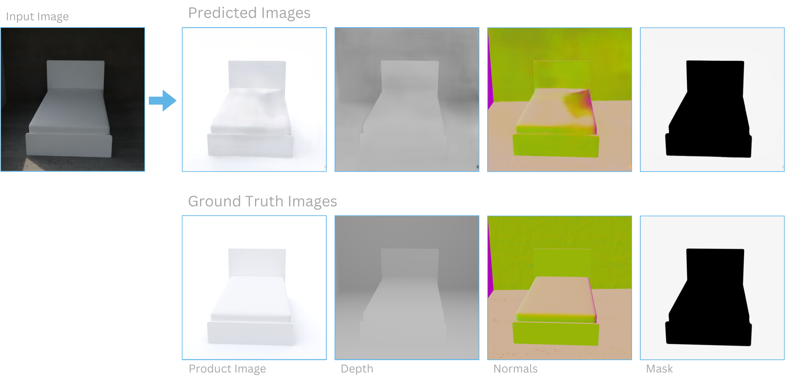
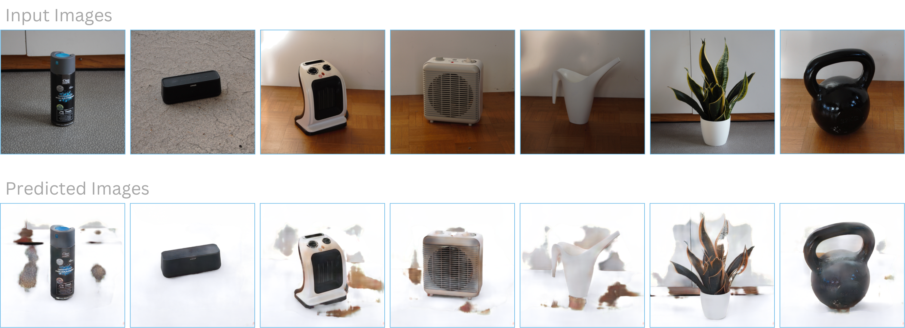

# Automatische Optimierung von Produktbildern

**Semester:** 7 (teilzeit)

**Teammitglieder:** Joël Grosjean

**Coaches:** Adrian Brändli und Moritz Kirschmann

**Datum:** 18.01.2024

## Inhaltsverzeichnis

- [Automatische Optimierung von Produktbildern](#automatische-optimierung-von-produktbildern)
  - [Inhaltsverzeichnis](#inhaltsverzeichnis)
  - [Idee](#idee)
  - [Experimentenreihe](#experimentenreihe)
    - [Entscheidung für Blender](#entscheidung-für-blender)
    - [Aufbau der Bildgenerierung](#aufbau-der-bildgenerierung)
    - [Erste Bildpaare](#erste-bildpaare)
    - [Visualisierungen von Normalen und Distanz zur Kamera](#visualisierungen-von-normalen-und-distanz-zur-kamera)
    - [Produktbild verbessern](#produktbild-verbessern)
    - [Bilder auf SLURM-Cluster generieren](#bilder-auf-slurm-cluster-generieren)
    - [Speicherplatz optimieren](#speicherplatz-optimieren)
    - [U-Net Modell trainieren](#u-net-modell-trainieren)
    - [U-Net Multi-Task Learning](#u-net-multi-task-learning)
    - [pix2pix Modell trainieren](#pix2pix-modell-trainieren)
    - [Qualitative Ergebnisse](#qualitative-ergebnisse)
    - [Ausblick](#ausblick)
  - [Reflexion Lernziele](#reflexion-lernziele)
  - [Meeting Notizen](#meeting-notizen)
    - [18.09.2023 - Kickoff und Definition der Lernziele](#18092023---kickoff-und-definition-der-lernziele)
    - [28.09.2023 - Finalisierung der Lernziele](#28092023---finalisierung-der-lernziele)
    - [04.10.2023 - Update zum Trainingsdaten generieren](#04102023---update-zum-trainingsdaten-generieren)
    - [18.10.2023 - Philosophie und Business Use Case](#18102023---philosophie-und-business-use-case)
    - [01.11.2023 - Stil der Produktfotos](#01112023---stil-der-produktfotos)
    - [29.11.2023 - Erste Bildserie und erstes Modell](#29112023---erste-bildserie-und-erstes-modell)
    - [13.12.2023 - Ausblick auf Fertigstellung](#13122023---ausblick-auf-fertigstellung)
    - [10.01.2024 - letztes Meeting vor Abgabe](#10012024---letztes-meeting-vor-abgabe)

## Idee

Die Idee dieser Arbeit ist es, Produktbilder zu "verschönern". Dies bedeutet den Hintergrund von den Produktbildern zu entfernen und die Beleuchtung der Bilder zu verbessern. Um ein solches Modell zu ermöglichen, braucht es Trainingsdaten. Da solche Daten nur sehr umständlich als echte Bilder gesammelt werden könnten, werden die Bildpaare in dieser Arbeit mithilfe einer 3D-Grafiksoftware gerendert.

Genaueres zur Idee für diese Arbeit kann man im [Challenge X Exposé](challenge_x_exposé.pdf) finden.

## Experimentenreihe

### Entscheidung für Blender

Ein entscheidender Schritt in diesem Projekt war die Generierung von Daten, wofür ich mich für die Verwendung der Software Blender entschieden habe. Diese Entscheidung war durch mehrere Faktoren motiviert.

Zunächst stellte sich heraus, dass andere gängige Programme wie Unreal Engine und Unity eine steilere Lernkurve aufwiesen. Obwohl diese Plattformen leistungsfähig sind, erfordern sie umfangreicheres Vorwissen und längere Einarbeitungszeiten. Im Gegensatz dazu bietet Blender eine benutzerfreundlichere Schnittstelle, die es ermöglicht, schneller produktiv zu arbeiten. Dies war für mein Projekt von wesentlicher Bedeutung, da es mir erlaubte, mehr Zeit für die tatsächliche Arbeit zu verwenden.

Ein weiterer entscheidender Vorteil von Blender ist seine Kompatibilität mit Python. Diese Integration ermöglichte es mir, Blender nahtlos in meinen Workflow einzubinden. Da Python auch für die Modellierung im Data-Science-Bereich verwendet wird, konnte ich Skripte und Funktionen direkt in Blender einbinden. Dies vereinfachte den Prozess der Datengenerierung erheblich, indem es mir ermöglichte, Automatisierungen und spezifische Anpassungen vorzunehmen, die genau auf die Bedürfnisse meines Projekts zugeschnitten waren.

Darüber hinaus bietet Blender eine umfangreiche Community und eine Vielzahl von Ressourcen, die den Einstieg und die Problembehandlung erleichtern. Die Open-Source-Natur von Blender fördert eine kollaborative Umgebung, in der ständig neue Plugins und Funktionen entwickelt werden, die sich ideal für innovative und experimentelle Projekte im Bereich Data Science eignen.

### Aufbau der Bildgenerierung

Das Ziel der Bildgenerierung ist es, möglichst realistische Bildpaare zu generieren. Dies ist wichtig, da das auf den synthetischen Bildern trainierte Modell auch auf echten Bildern funktionieren soll. Nun werde ich auf mein Vorgehen eingehen, das dies ermöglichen soll.

Grundsätzlich soll ein Input Bild generiert werden, bei welchem das Produkt in einem Raum steht, und ein Output Bild, bei welchem das Produkt gut beleuchtet vor einem weissen Hintergrund steht. Wie man auf der Abbildung sehen kann, wird dafür zum Rendern der Bilder in Blender eine virtuelle Kamera platziert.

Um realistische Bilder generieren zu können brauchte ich ein paar Dinge: 3D-Modelle von Inneneinrichtungsgegenständen, Texturen für den Raum und HDRIs für die Hintergründe und das Licht. Ich werde nun noch kurz auf diese Dinge eingehen.

Für die Inneneinrichtungsgegenstände habe ich [interior models](https://www.blendermarket.com/products/1000-interior-models) verwendet. Dies ist ein Paket von ca. 2500 verschiedenen Gegenständen, welche ich für ca. 70 CHF gekauft habe. Leider konnte ich kein grosses Paket von gratis Assets von hoher Qualität finden und habe mich deshalb für dieses kostenpflichtige Paket entschieden.

Um realistisches Licht und zugleich Hintergründe bei Fenstern zu erreichen, kann man HDRIs verwenden. Ein HDRI (High Dynamic Range Image) in der 3D-Modellierung und beim Rendering ist eine 360-Grad-Panoramabildaufnahme, die zur Beleuchtung und Reflexion in einer Szene eingesetzt wird, um realistische Lichtverhältnisse und Umgebungsreflexionen zu simulieren. Die HDRIs habe ich von [polyhaven](https://polyhaven.com/hdris) heruntergeladen.

Auch die Texturen für den Raum habe ich von [polyhaven](https://polyhaven.com/textures) heruntergeladen. Diese haben ebenfalls eine sehr hohe Qualität und erlauben es sehr einfach realistische Oberflächen zu erreichen, welche realistisch mit dem Licht in der Szene interagieren.

Um Bildpaare zu generieren, habe ich mein Programm dann so strukturiert, dass es vereinfacht folgenden Ablauf für jedes Bildpaar durchläuft:

- Produkt Platzieren
- Produktgrösse herausfinden
- Kamera aufgrund der Produktgrösse platzieren und ausrichten
- Licht, HDRI und Oberflächen platzieren
- Produktbild generieren (Output Bild)
- Oberflächen entfernen
- Licht und HDRI anpassen
- Raum basierend auf Produktgrösse und Kameraposition generieren
- Input Bild generieren (Bild mit Produkt und Raum)

Damit meine Bilder nicht für das gleiche Produkt immer gleich aussehen, sondern eine natürliche Variation aufweisen, musste ich auf einige verschiedene Arten Zufälligkeit bei der Bildgenerierung hinzufügen. Diese musste immer so abgestimmt werden, dass sie in jedem Fall zu "realistischen" Resultaten führte. Folgende Arten von Zufälligkeit habe ich hinzugefügt:

- Produktausrichtung (Rotation um y-Achse)
- Grösse des Raums
- Grösse und Anzahl der Fenster
- Texturen (Wände, Boden und Decke)
- Licht (HDRI und Orientierung des HRDIs und Raumlicht, wenn zu wenig hell)
- Kamera (Position, Zoom, Fokus, Rotation entlang y-Achse)

### Erste Bildpaare

Bei dem Experiment, welches auf folgendem Bild dargestellt wird, konnte ich zum ersten Mal Bildpaare von verschiedenen Pflanzen generieren. Es fällt auf, dass die Pflanze bei beiden Bildern des Bildpaares in der gleichen Position mit derselben Ausrichtung ist. Die Kamera zeigt auch immer auf die Pflanze und hat den richtigen Zoom eingestellt, damit die Pflanze einen relativ grossen Teil des Bildes ausfüllt und trotzdem ganz ins Bild passt. Beim zweiten Bild fällt auf, dass der Raum um das Produkt herum hier noch nicht fertig modelliert ist.

### Visualisierungen von Normalen und Distanz zur Kamera

Es können weitere Bilder mit zusätzlichen Informationen hinzugefügt werden, welche später das Modell-Training unterstützen, indem sie dem Modell das 3-Dimensionale Verständnis erleichtern. Dass dies das Training erleichtert, ist zumindest die momentane Hypothese. Im Bild unterhalb sieht man zuoberst das schmutzige Bild, danach eine Visualisierung der Normalen, dann eine Visualisierung der Distanz zur Kamera und als Letztes das Produktbild. Um die Visualisierungen zu generieren habe ich zuerst ein benutzerdefiniertes Shader Node Setup erstellt und füge dieses allen Materialien im Python Script als `Surface` hinzu.

### Produktbild verbessern

Mir war es ein besonderes Anliegen, dass das generierte Produktbild einem spezifischen Stil gerecht wird. Das Bild sollte folgende Kriterien erfüllen: Es sollte einen komplett weissen Hintergrund aufweisen und weder unter- noch überbelichtet sein. Eine nicht ganz symmetrische Beleuchtung von links und rechts war ebenfalls wichtig, um die Form des Produkts hervorzuheben, dabei sollte die Beleuchtung jedoch sehr weich sein. Zudem war ein leichter Schatten erwünscht, um dem Bild eine realistischere, physikalische Anmutung zu verleihen.

Direkt in Blender war es für mich nicht möglich, Bilder zu erstellen, die all diesen Qualitätskriterien entsprachen. Ein komplett weisser Hintergrund war beispielsweise praktisch unerreichbar. Allerdings konnte ich die Bilder mit einem Skript so nachbearbeiten, dass die Ergebnisse meinen Vorstellungen entsprachen. Die finalen Produktbilder sind in der nachfolgenden Grafik dargestellt.

Wie aus der Grafik ersichtlich, habe ich im Rahmen dieses Projekts Produktbilder in drei unterschiedlichen Stilen generiert. Für die Modellierung in dieser Arbeit habe ich mich jedoch ausschliesslich auf den ersten Stil konzentriert. Insgesamt wurden 16'048 Bilder generiert, eine Zahl, die nur dank der Nutzung des SLURM-Clusters erreicht werden konnte. Auf diese Ressource und ihre Bedeutung für das Projekt werde ich im nächsten Abschnitt näher eingehen. Zusätzlich zu den generierten Bildern habe ich auch 24 echte Bilder aufgenommen, um das Modell anhand realer Beispiele testen zu können.

| Datensatz    | Anzahl |
| :----------- | -----: |
| Training     |  11233 |
| Validation   |   3210 |
| Test         |   1605 |
| echte Bilder |     24 |

### Bilder auf SLURM-Cluster generieren

Die Entscheidung Blender zu nutzen habe ich unter anderem getroffen, weil ich wusste, dass Blender einen extrem schnellen Renderer names Eevee besitzt, welcher Bilder praktisch in real-time rendern kann. Ein solcher Renderer erlaubt es selbst auf einem Laptop innerhalb eines Tages einen sehr grossen Datensatz zu generieren. Leider hat sich herausgestellt, dass die Qualität des Eevee Renderers für meine Zwecke nicht gut genug ist, und ich stattdessen den deutlich leistungs-intensiveren Cycles Renderer benutzen musste. Nach einigem Optimieren konnte ich auf meinem Desktoprechner Bilder genügender Qualität in ca. 30 Sekunden pro Bild generieren. Dies machte es praktisch unmöglich auf meinem Desktop-PC die nötigen Trainingsbilder zu generieren, da ich meinen Rechner mehrere Wochen komplett hätte auslasten müssen.

Um dieses Problem zu lösen, habe ich mich entschieden die Bilder auf dem SLURM-CLuster des i4DS der FHNW zu generieren. Dies bedeutete jedoch auch, dass ich Blender auf dem Compute-Cluster laufen lassen musste. Dies hat sich als relativ schwierig herausgestellt, weil ich keinen Singularity Container mit der richtigen Version von Blender finden konnte. Nach einiger Recherche und zahlreichen Versuchen habe ich einen [Docker Container](https://github.com/linuxserver/docker-blender) gefunden, welcher die richtige Version (3.6.5) von Blender nutzte und auf dem Cluster tatsächlich lief. Bei diesem ganzen Prozess stand mir Moritz immer wieder zur Seite und half mir enorm weiter.

### Speicherplatz optimieren

Da ich sehr viele Bilder generierte, brauchten diese sehr viel Speicherplatz. Da alle Operationen, wie zum Beispiel das Herunterladen der Bilder plötzlich sehr lange brauchten, kam ich auf die Idee den Speicherplatzbedarf der Bilder zu reduzieren. Ich habe hierzu die Schwarz-Weiss Bilder mit nur einem Farbkanal abgespeichert und die restlichen mit drei statt vier Farbkanälen. Dies führte zu einer enormen Reduktion des benötigten Speichers, ohne die Qualität der Bilder zu reduzieren. Gesamthaft brauchten die generierten Bilder nach dem Optimieren des Speicherbedarfs nur noch ca. 21 % des zuvor benötigten Speicherplatzes.

Es könnten noch weitere Dinge gemacht werden, um den Speicherplatzbedarf zu reduzieren, aber viele davon würden zu einer Reduktion der Datenqualität führen oder sehr viel Rechenleistung beanspruchen. Ein Beispiel dafür ist der Wechsel in vom PNG-Bildformat ins JPG-Bildformat, was ich unterlassen habe, da JPG im Gegensatz zu PNG keine verlustfreie Komprimierung zulässt. Selbst das starke Komprimieren der Bilder im PNG Format habe ich unterlassen, da dies relativ Rechenintensiv ist, und nur wenig Speicherplatz spart.

### U-Net Modell trainieren

Für mein baseline Modell habe ich die U-Net Architektur ausgewählt. Ich habe diese Architektur ausgewählt, weil sie bekannt dafür ist, bei Segmentierungsproblemen gut zu funktionieren und zusätzlich einfach zu verstehen ist. Ich habe die Architektur aus dem [U-Net Paper](https://arxiv.org/abs/1505.04597) nachgebaut. Meine grösste Änderung gegenüber dem originalen Paper ist, dass der Output dieselbe Auflösung hat wie der Input.

Auf dieser Abbildung sind fünf zufällige Outputs des U-Nets den generierten Bildern gegenübergestellt. Wie man sehen kann, sehen die Outputs mit dem baseline Modell schon sehr gut aus. Es fallen kleine Abweichungen auf, aber generell scheint das Modell auf den synthetischen Daten gut zu funktionieren.

| Anzahl Bilder | MSE    |
| ------------: | ------ |
|           100 | 0.0305 |
|           333 | 0.0082 |
|          1000 | 0.0042 |
|          3333 | 0.0026 |
|         10000 | 0.0017 |

Zum Vergleich der Modelle verwende ich den Mean Squared Error (MSE) auf den Validierungsdaten. Ich habe für das U-Net ein Experiment durchgeführt, bei welchem ich es nur auf einem Teil der Trainingsdaten trainierte, um festzulegen, ob die weiteren Daten dem Modell noch helfen, weiteres zu lernen. Dies ist definitiv der Fall und das Modell mit 10'000 Bildern im Trainingsdatensatz hat mit Abstand den besten MSE.

### U-Net Multi-Task Learning

Die Idee hinter diesem Modell war es, dass es mehr, oder zumindest schneller die Aufgabe lernen wird, falls es mehrere verwandte Aufgaben lernen muss. Deshalb wird hier im Output nicht nur ein RGB-Bild mit 3 Layer, sondern ein gleich 4 Bilder vorhergesagt: Es werden das Produktbild (3 Layer), die Produkt-Maske (1 Layer, weil Schwarz-Weiss), die Entfernung zur Kamera (1 Layer, weil Schwarz-Weiss) und die Oberflächen-Normalen (3 Layer) vorhergesagt. Dies gibt uns also insgesamt 8 Channels im Output.

Bei einem solchen Modell, ist es wichtig, dass bei der Data Augmentation keine geometrischen Transformationen durchgeführt werden, da dies die Oberflächen-Normalen verfälschen würde. Um die Vergleichbarkeit in dieser Arbeit zu gewährleisten habe ich deshalb in der gesamten Arbeit auf geometrische Transformationen in der Data Augmentation verzichtet.

Leider hat sich herausgestellt, dass in meinem Fall das Multi-Task Learning keinen starken Effekt auf das Ergebnis hatte. Der MSE auf den Validierungsdaten ist gegenüber dem U-Net praktisch gleich. Das Modell mit Multi-Task Learning lernt etwas schneller, jedoch lernt es am Ende nicht mehr, als das originale U-Net. Dies ist in meinem [Weights & Biases Report](https://api.wandb.ai/links/tez4/haj73uoz) ersichtlich.

| Multi-Task Learning | MSE     |
| ------------------: | ------- |
|              Falsch | 0.00172 |
|                Wahr | 0.00176 |

Auch hier fällt auf, dass das Modell für dieses Beispiel sehr gut funktioniert. Es fällt eine ganz leichte Unschärfe auf, und kleine Ungenauigkeiten an einigen Stellen. Unten rechts, ist bei diesem Bild auch ein Artefakt zu sehen. Dieses ist wahrscheinlich beim Upsampling entstanden, dies habe ich jedoch nicht genauer untersucht.

Dies ist ein Beispiel, bei welchem das Modell einen sehr offensichtlichen Fehler bei den Normalen des Bettes gemacht hat. Ich finde es sehr interessant, dass an derselben Stelle im Produktbild auch ein Fehler entsteht. Dies ist ein Indiz dafür, dass dieselbe information in den Normalen und der Beleuchtung des Produktes verwendet wird. Somit gibt mir dies die Sicherheit, dass die Normalen sehr wohl nützlich sind, jedoch das Modell auch ohne die Hilfe von Multi-Task Learning diese Information lernen kann.

### pix2pix Modell trainieren

In einem nächsten Schritt habe ich ein pix2pix Modell trainiert. Dieses besteht wie bisher aus einem U-Net als Generator und zusätzlich aus einem PatchGAN als Discriminator. Details dazu sind im [pix2pix Paper](https://arxiv.org/abs/1611.07004). Der Discriminator lernt die Target-Bilder von den Output-Bildern zu unterscheiden. Der Schätzfehler fliesst dann als Adversarial Loss in den Generator Loss ein.

| Architektur | MSE     |
| ----------: | ------- |
|       U-Net | 0.00169 |
|     pix2pix | 0.00172 |

Das Hinzufügen eines Discriminators hat den Validation MSE nicht verbessert. Üblicherweise werden die Bilder beim Hinzufügen eines Discriminators schärfer, Ich konnte Qualitativ jedoch keinen Unterschied zu den Ergebnissen des U-Nets feststellen. Falls man dies genauer Untersuchen möchte, wäre hier sicherlich eine Metrik zum Messen der Schärfe des Resultates hilfreich.

### Qualitative Ergebnisse

Die von mir aufgenommenen echten Bilder habe ich aus Zeitgründen nur qualitativ und nicht quantitativ bewertet. Dies war hier auch noch gar nicht nötig, weil aufgrund der Ergebnisse schnell klar wird, dass die Resultate noch nicht zufriedenstellend sind.

Wie man auf diesen Bildern sehen kann, kann das Modell auf echten Bildern nicht korrekt zwischen dem Vordergrund und dem Hintergrund unterscheiden. Generell wird das Produkt korrekt ausgeschnitten, jedoch werden teilweise Teile des Hintergrunds nicht ausgeschnitten.

Ein Beispiel vom Multi-Task Modell gibt uns noch etwas mehr Informationen dazu, was schon korrekt funktioniert und was nicht. Wie man hier klar sehen kann, funktioniert tatsächlich die Unterscheidung zwischen Vordergrund und Hintergrund nicht korrekt, denn auch auf der Maske macht das Modell diesen Fehler. Wie uns jedoch die Normalen zeigen, versteht das Modell das Produkt ziemlich gut. Die Normalen der Spritzkanne sehen nämlich ziemlich korrekt aus.

Was könnte denn nun der Grund sein, warum das Modell den Hintergrund nicht gut vom Vordergrund unterscheiden kann? Ich nehme an, dass das Modell gelernt hat, dass die Texturen im Hintergrund eine höhere Auflösung und weniger flache Oberflächen haben, als die Texturen des Produktes. Dies könnte daran liegen, dass ich nur ein paar wenige sehr hoch aufgelöste Texturen für den modellierten Raum verwendet habe. Das Hinzufügen von mehr und flacheren Texturen im Hintergrund bei der Bildgenerierung könnte dem Modell helfen, um die Abtrennung vom Hintergrund auf echten Bildern korrekt vornehmen zu können.

### Ausblick

Bei diesem Projekt konnte ich viele wertvolle Erfahrungen sammeln und spannende Ergebnisse erzielen. Allerdings gibt es einige Aspekte, die ich in einem zukünftigen Projekt anders angehen würde. Zum Beispiel würde ich früher damit beginnen, Modelle zu trainieren und diese bereits in einem frühen Stadium mit echten Daten zu testen. Dadurch könnten die gewonnenen Erkenntnisse effektiver in die Bildgenerierung einfliessen. Zudem wäre es sinnvoll, für die realen Daten eine Ground-Truth-Maske zu erstellen, um quantitative Aussagen über die Leistungsfähigkeit des Modells auf echten Bildern treffen zu können. Hierfür würde sich beispielsweise der DICE-Score als Bewertungskriterium anbieten. Dies würde es ermöglichen, Anpassungen bei der Bildgenerierung auch quantitativ zu evaluieren.

Ein weiteres Problem stellte mein Ansatz für den Train-Test-Split dar. Hier hätte man das Risiko von Data Leakage verringern können, indem man zum Beispiel unterschiedliche Texturen für die Raummodellierung in den Input-Bildern der Trainings- und Testdatensätze verwendet hätte. Ähnliches gilt für die Auswahl der Produkte und HDRIs. Ein weiteres Ziel des Projekts war es, das Portfolio stets aktuell zu halten, was mir leider nicht in vollem Umfang gelungen ist.

In der begrenzten Zeit, die mir für dieses Projekt zur Verfügung stand, war es mir leider nicht möglich, all meine Ideen umzusetzen. Es gibt viele Ansätze, die potenziell zu besseren Ergebnissen führen könnten und die ich gerne getestet hätte oder die in zukünftigen Arbeiten erforscht werden könnten. Eine Möglichkeit wäre beispielsweise, ein Modell ohne die Verwendung von Surface Normals zu trainieren. Dies würde erlauben, geometrische Transformationen in der Data Augmentation zu nutzen, was durch eine verbesserte Datenanreicherung die Leistungsfähigkeit des Modells möglicherweise deutlich steigern könnte. Auch könnte die Vielfalt der generierten Bilder noch erheblich erhöht werden. Man könnte etwa die Produkte vor einer grösseren Bandbreite an Texturen rendern, einschliesslich einfacher weisser oder flacher Hintergründe sowie Wänden mit Oberflächenfehlern. Die Diversität der Hintergründe liesse sich weiter steigern, indem die Produkte nicht nur vor einer Wand, sondern beispielsweise auch vor Schränken oder Wänden mit Fussleisten platziert werden. Generell könnte der Realismus der generierten Bilder noch verbessert werden, zum Beispiel durch Nachbearbeitungen wie das Hinzufügen von Kamerakorn, leichte Unschärfen oder Bildkompressionsartefakte.

Auch bei den Modellen gibt es Verbesserungspotenzial. Die Beurteilung der Resultate ist momentan eher schwierig, und zusätzliche Metriken könnten hier hilfreich sein. Beispielsweise Metriken zur Beurteilung der Bildschärfe, Segmentierungsmetriken für die Produktmaske oder allgemein Metriken, die Bilder eher aus der Perspektive des menschlichen Auges bewerten, anstatt nur Pixelabweichungen zu messen. Es könnte auch lohnenswert sein, eine ganz andere Modellart zu erproben, wie etwa Unpaired Image-to-Image Translation. Hierbei könnten Modellarchitekturen wie UNIT oder StarGAN interessant sein.

Sollte es möglich sein, hochwertige Produktbilder zu generieren, stellt sich natürlich auch die Frage nach den Implikationen eines solchen Modells und wie es angewendet werden kann und sollte.

## Reflexion Lernziele

| ID   | Lernziel                                                                | Erfüllung    |
| :--- | :---------------------------------------------------------------------- | ------------ |
| K2L3 | Ein Data Science Projekt ausführen können                               | Ich habe verschiedene Modelle aufgrund einer Metrik auf dem Validierungsdatensatz verglichen. Die Qualität der Daten habe ich jedoch nicht quantitativ beurteilt. |
| K2L4 | Code systematisch strukturieren und testen können                       | Eingabefehler werden abgewickelt und Logging wurde bei der Daten-Generierung und dem Modell training verwendet. Parameter können einfach durch config Dateien festgelegt werden.  |
| K3L2 | Strategie, Methoden und Resultaten analysieren und evaluieren können    | Während der Arbeit fand ich zum Beispiel heraus, dass der Eevee Renderer nicht gut genug war ([Bilder auf SLURM-Cluster generieren](#bilder-auf-slurm-cluster-generieren)) und musste meinen Plan entsprechend anpassen. Auch im [Ausblick](#ausblick) werden die Resultate analysiert. |
| K3L3 | Code dokumentieren und versionieren können                              | Die Repositories wurden veröffentlicht. |
| K4L3 | Projekt durchführen können                                              | Das [Challenge X Exposé](challenge_x_exposé.pdf) beschreibt die originale Idee und die Umsetzung wurde in diesem Report dokumentiert. |
| K6L2 | Kritisch Denken und Handeln                                             | Durch die Meetings mit den Coaches konnten einige Probleme diskutiert und kritisch hinterfragt werden. Die Ergebnisse wurden im Portfolio kritisch und offen diskutiert. |
| K7L2 | Lernbereitschaft zeigen                                                 | Schon vor dem Start des Projektes habe ich mit dem Rendern der Produktbilder angefangen, um die entsprechende Wissenslücke früh und proaktiv zu schliessen. |
| K5L1 | Mit Beteiligten kommunizieren und zusammenarbeiten können               | Portfolio wurde gemäss Diskussion mit Coaches aufgebaut und Meetings wurden regelmässig und sinnvoll durchgeführt. |
| K3L4 | Reproduzierbarkeit und Deployment sicherstellen können                  | Python Dependencies werden mit Pipenv installiert und Machine Learning Experimente wurden auf [Weights & Biases](https://api.wandb.ai/links/tez4/haj73uoz) hochgeladen. |
| K6L1 | Kreativ sein und innovativ denken können                                | Trainingsdaten wurden selbst mit Blender generiert. |
| K7L1 | Zuverlässig sein und Eigeninitiative und Motivation zeigen              | Ich habe die Termine eingehalten und eine Arbeit zu einem Thema durchgeführt, welches ich noch nicht kannte. |
| K7L3 | Reflexionsfähigkeit zeigen                                              | Über die gemachten Fehler wurde besonders im [Ausblick](#ausblick) reflektiert. |
| K5L2 | Zwischen- und Endresultate mündlich und schriftlich präsentieren können | Die Verteidigung fand am 17.01.2024 statt. |

## Meeting Notizen

### 18.09.2023 - Kickoff und Definition der Lernziele

Meeting findet direkt nach Challenge X launch statt. Folgende Dinge werden besprochen:

Organisatorisch:

- Coaches werden Lernziele zusammen bestimmen. Joel wird diese danach noch ergänzen.
- Meeting-Frequenz mit Coaches wurde bestimmt.
- Portfolio soll als Markdown in GitHub gespeichert werden.
- Erste Wochen sollen vor allem zum Trainingsdaten generieren genutzt werden.

Trainingsdaten generieren:

- JSON Datei mit Metadaten soll für jedes Bild zusätzlich generiert werden.
- Tiefeninformation des Bildes kann zusätzlich gespeichert werden.
- Segmentierungsmaske vom Produkt kann zusätzlich gespeichert werden.

### 28.09.2023 - Finalisierung der Lernziele

Beim Meeting waren Joël und Adrian anwesend.

- Die definierten Lernziele wurden ausdiskutiert, aber nicht mehr angepasst. Für Joël und Adrian passen sie so.
- Einige Indikatoren der Lernziele sind für Joël noch unklar, Joël wird dafür eine Fragemail an Moritz senden.
- Adrian bestätigte, dass er nun Zugriff auf die Repositories hat.
- Die Struktur des Portfolios wurde kurz besprochen, Adrian gab kleine Anpassungsvorschläge, aber grundsätzlich findet er die Struktur in Ordnung.

### 04.10.2023 - Update zum Trainingsdaten generieren

Beim Meeting waren Adrian, Moritz und Joël anwesend.

Organisatorisch:

- Ab dem nächsten Meeting sollen die Meetings nicht mehr online, sondern in der FHNW stattfinden.
- Um so viele Bilder zu generieren, braucht es sehr viel GPU Leistung. Moritz organisiert deshalb für ihn und Joël eine Einführung in das Compute-Cluster des i4DS.
- Nach kurzer Diskussion mit Moritz sind nun die Lernziele definitiv für alle.

Trainingsdaten generieren:

- Die Bilder welche die Textur und das Licht trennen, scheinen allen eher nicht sinnvoll zu sein. Deshalb wird Joël diese weglassen.
- Joël fragt, ob das Bild mit der Distanz normalisiert werden sollte. Moritz befindet dies als sinnvoll.
- Das Produktfoto soll noch verbessert werden. Hier soll Joël noch eine Recherche betreiben und experimentieren.
- Es können mehrere Versionen des Produktfotos gespeichert werden. Dies erlaubt im Modell kreative Ansätze auszuprobieren.
- Bilder müssen nicht unbedingt im .PNG format gespeichert werden. Hier kann Speicherplatz eingespart werden.

### 18.10.2023 - Philosophie und Business Use Case

Beim Meeting waren Adrian, Moritz und Joël anwesend.

- Joël hat Blender noch nicht zum Laufen gebracht.
- Beim Produktfoto konnte Joël auch kein Fortschritt machen, da er viele andere Dinge machen musste.
- Adrian stiess eine Diskussion über die Philosophie, warum dieses Produkt nützlich ist, an.
- Adrian regte Joël an noch über den Business Use Case zu reflektieren. Er meinte, es wäre wertvoll sich mit möglichen konkreten Anwendungsfällen zu beschäftigen.
- Es wurde ebenfalls diskutiert, Literatur zu ähnlichen arbeiten in den Bericht einzubringen.

### 01.11.2023 - Stil der Produktfotos

Beim Meeting waren Adrian, Moritz und Joël anwesend.

- Joël hat mit dem Rendern in Compute Cluster einige Fortschritte gemacht, es gibt jedoch immer noch einen Fehler.
- Joël hat einige Vorschläge für den Stil der Produktfotos gemacht und hat diese Ausführlich mit Adrian und Moritz diskutiert.
- Adrian wünscht, dass Joël die gewünschten Eigenschaften für die Produktbilder definiert.

### 29.11.2023 - Erste Bildserie und erstes Modell

Beim Meeting waren Adrian, Moritz und Joël anwesend.

- Joël berichtet, dass er mithilfe von Moritz Blender auf dem Compute Cluster einrichten konnte.
- Joël berichtet ebenfalls, dass er nun eine erste Serie von etwa 1000 Bilder generiert hat.
- Den Stil für die Produktfotos hat Joël nun definiert.
- Ein erstes Modell hat Joël nun auch schon trainiert und präsentiert die Resultate.
- Joël gibt, mithilfe von Moritz, Adrian eine kleine Einführung in Deep Learning.

### 13.12.2023 - Ausblick auf Fertigstellung

Beim Meeting waren Adrian, Moritz und Joël anwesend.

- Anzahl der gesammelten Daten ist mit etwas mehr als 10000 Bildern Okay.
- Format der Verteidigung wurde besprochen. Es gibt eine Präsentation von 30 Minuten.
- Modelle sollen noch verglichen werden und im Bericht beschrieben werden.
- Bilineares Upsampling soll ausprobiert werden, um Schachbrettmuster von Output-Bildern zu entfernen.
- Dokumentation soll aktualisiert werden.
- In der Dokumentation kann über die Erfüllung der Lernziele reflektiert werden.

### 10.01.2024 - letztes Meeting vor Abgabe

Beim Meeting waren Adrian, Moritz und Joël anwesend.

- Joël erzählt von den Experimenten, welche er in den letzten Wochen gemacht hat.
- Die Ergebnisse der Experimente werden gemeinsam reflektiert und diskutiert.
- Der Ausblick und die Limitationen der Arbeit werden besprochen.
- Einige Details zu der Abgabe und der Präsentation werden besprochen.
