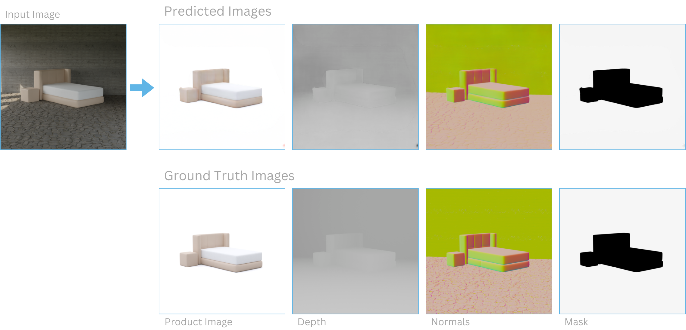

# Automatische Optimierung von Produktbildern

**Semester:** 7 (teilzeit)

**Teammitglieder:** Joël Grosjean

**Coaches:** Adrian Brändli und Moritz Kirschmann

**Datum:** 18.01.2024

## Inhaltsverzeichnis

- [Automatische Optimierung von Produktbildern](#automatische-optimierung-von-produktbildern)
  - [Inhaltsverzeichnis](#inhaltsverzeichnis)
  - [Idee](#idee)
  - [Experimentenreihe](#experimentenreihe)
    - [Entscheidung für Blender](#entscheidung-für-blender)
    - [Aufbau der Bildgenerierung](#aufbau-der-bildgenerierung)
    - [Erste Bildpaare](#erste-bildpaare)
    - [Visualisierungen von Normalen und Distanz zur Kamera](#visualisierungen-von-normalen-und-distanz-zur-kamera)
    - [Produktbild verbessern](#produktbild-verbessern)
    - [Bilder auf SLURM-Cluster generieren](#bilder-auf-slurm-cluster-generieren)
    - [Speicherplatz optimieren](#speicherplatz-optimieren)
    - [U-Net Modell trainieren](#u-net-modell-trainieren)
    - [U-Net Multi-Task Learning](#u-net-multi-task-learning)
    - [pix2pix Modell trainieren](#pix2pix-modell-trainieren)
    - [Qualitative Ergebnisse](#qualitative-ergebnisse)
    - [Ausblick](#ausblick)
  - [Reflexion Lernziele](#reflexion-lernziele)
  - [Meeting Notizen](#meeting-notizen)
    - [18.09.2023 - Kickoff und Definition der Lernziele](#18092023---kickoff-und-definition-der-lernziele)
    - [28.09.2023 - Finalisierung der Lernziele](#28092023---finalisierung-der-lernziele)
    - [04.10.2023 - Update zum Trainingsdaten generieren](#04102023---update-zum-trainingsdaten-generieren)
    - [18.10.2023 - Philosophie und Business Use Case](#18102023---philosophie-und-business-use-case)
    - [01.11.2023 - Stil der Produktfotos](#01112023---stil-der-produktfotos)
    - [29.11.2023 - Erste Bildserie und erstes Modell](#29112023---erste-bildserie-und-erstes-modell)
    - [13.12.2023 - Ausblick auf Fertigstellung](#13122023---ausblick-auf-fertigstellung)
    - [10.01.2024 - letztes Meeting vor Abgabe](#10012024---letztes-meeting-vor-abgabe)

## Idee

Die Idee dieser Arbeit ist es, Produktbilder zu "verschönern". Dies bedeutet den Hintergrund von den Produktbildern zu entfernen und die Beleuchtung der Bilder zu verbessern. Um ein solches Modell zu ermöglichen, braucht es Trainingsdaten. Da solche Daten nur sehr umständlich als echte Bilder gesammelt werden könnten, werden die Bildpaare in dieser Arbeit mithilfe einer 3D-Grafiksoftware gerendert.

Genaueres zur Idee für diese Arbeit kann man im [Challenge X Exposé](challenge_x_exposé.pdf) finden.

## Experimentenreihe

### Entscheidung für Blender

Ein entscheidender Schritt in diesem Projekt war die Generierung von Daten, wofür ich mich für die Verwendung der Software Blender entschieden habe. Diese Entscheidung war durch mehrere Faktoren motiviert.

Zunächst stellte sich heraus, dass andere gängige Programme wie Unreal Engine und Unity eine steilere Lernkurve aufwiesen. Obwohl diese Plattformen leistungsfähig sind, erfordern sie umfangreicheres Vorwissen und längere Einarbeitungszeiten. Im Gegensatz dazu bietet Blender eine benutzerfreundlichere Schnittstelle, die es ermöglicht, schneller produktiv zu arbeiten. Dies war für mein Projekt von wesentlicher Bedeutung, da es mir erlaubte, mehr Zeit für die tatsächliche Arbeit zu verwenden.

Ein weiterer entscheidender Vorteil von Blender ist seine Kompatibilität mit Python. Diese Integration ermöglichte es mir, Blender nahtlos in meinen Workflow einzubinden. Da Python auch für die Modellierung im Data-Science-Bereich verwendet wird, konnte ich Skripte und Funktionen direkt in Blender einbinden. Dies vereinfachte den Prozess der Datengenerierung erheblich, indem es mir ermöglichte, Automatisierungen und spezifische Anpassungen vorzunehmen, die genau auf die Bedürfnisse meines Projekts zugeschnitten waren.

Darüber hinaus bietet Blender eine umfangreiche Community und eine Vielzahl von Ressourcen, die den Einstieg und die Problembehandlung erleichtern. Die Open-Source-Natur von Blender fördert eine kollaborative Umgebung, in der ständig neue Plugins und Funktionen entwickelt werden, die sich ideal für innovative und experimentelle Projekte im Bereich Data Science eignen.

### Aufbau der Bildgenerierung

Das Ziel der Bildgenerierung ist es, möglichst realistische Bildpaare zu generieren. Dies ist wichtig, da das auf den synthetischen Bildern trainierte Modell auch auf echten Bildern funktionieren soll. Nun werde ich auf mein Vorgehen eingehen, das dies ermöglichen soll.

Grundsätzlich soll ein Input Bild generiert werden, bei welchem das Produkt in einem Raum steht, und ein Output Bild, bei welchem das Produkt gut beleuchtet vor einem weissen Hintergrund steht. Wie man auf der Abbildung sehen kann, wird dafür zum Rendern der Bilder in Blender eine virtuelle Kamera platziert.

Um realistische Bilder generieren zu können brauchte ich ein paar Dinge: 3D-Modelle von Inneneinrichtungsgegenständen, Texturen für den Raum und HDRIs für die Hintergründe und das Licht. Ich werde nun noch kurz auf diese Dinge eingehen.

Für die Inneneinrichtungsgegenstände habe ich [interior models](https://www.blendermarket.com/products/1000-interior-models) verwendet. Dies ist ein Paket von ca. 2500 verschiedenen Gegenständen, welche ich für ca. 70 CHF gekauft habe. Leider konnte ich ein grosses Paket von gratis Assets von hoher Qualität finden und habe mich deshalb für diese entschieden.

Um realistisches Licht und zugleich Hintergründe bei Fenstern zu erreichen, kann man HDRIs verwenden. Die HDRIs habe ich von [polyhaven](https://polyhaven.com/hdris) heruntergeladen, diese sind alle gratis und haben sehr gute Qualität.

Auch die Texturen für den Raum habe ich von [polyhaven](https://polyhaven.com/textures) heruntergeladen. Diese haben ebenfalls eine sehr hohe Qualität und erlauben es sehr einfach realistische Oberflächen zu erreichen, welche realistisch mit dem Licht in der Szene interagieren.

Um Bildpaare zu generieren, habe ich mein Programm dann so strukturiert, dass es vereinfacht folgenden Ablauf für jedes Bildpaar durchläuft:

- Produkt Platzieren
- Produktgrösse herausfinden
- Kamera aufgrund der Produktgrösse platzieren und ausrichten
- Licht, HDRI und Oberflächen platzieren
- Produktbild generieren (Output Bild)
- Oberflächen entfernen
- Licht und HDRI anpassen
- Raum basierend auf Produktgrösse und Kameraposition generieren
- Input Bild generieren (Bild mit Produkt und Raum)

Damit meine Bilder nicht für das gleiche Produkt immer gleich aussehen, sondern eine natürliche Variation aufweisen, musste ich auf einige verschiedene Arten Zufälligkeit bei der Bildgenerierung hinzufügen. Diese musste immer so abgestimmt werden, dass sie in jedem Fall zu "realistischen" Resultaten führte. Folgende Arten von Zufälligkeit habe ich hinzugefügt:

- Produktausrichtung (Rotation um y-Achse)
- Grösse des Raums
- Grösse und Anzahl der Fenster
- Texturen (Wände, Boden und Decke)
- Licht (HDRI und Orientierung des HRDIs und Raumlicht, wenn zu wenig hell)
- Kamera (Position, Zoom, Fokus, Rotation entlang y-Achse)

### Erste Bildpaare

Bei dem Experiment, welches auf folgendem Bild dargestellt wird, konnte ich zum ersten Mal Bildpaare von verschiedenen Pflanzen generieren. Es fällt auf, dass die Pflanze bei beiden Bildern des Bildpaares in der gleichen Position mit derselben Ausrichtung ist. Dies hilft, um dem Modell das Training zu erleichtern. Die Kamera zeigt auch immer auf die Pflanze und hat den richtigen Zoom eingestellt, damit die Pflanze einen relativ grossen Teil des Bildes ausfüllt und trotzdem ganz ins Bild passt. Beim zweiten Bild fällt auf, dass der Raum um das Produkt herum hier noch nicht fertig modelliert ist.

### Visualisierungen von Normalen und Distanz zur Kamera

Es können weitere Bilder mit zusätzlichen Informationen hinzugefügt werden, welche später das Modell-Training unterstützen, indem sie dem Modell das 3-Dimensionale Verständnis erleichtern. Dass dies das Training erleichtert, ist zumindest die momentane Hypothese. Im Bild unterhalb sieht man zuoberst das schmutzige Bild, danach eine Visualisierung der Normalen, dann eine Visualisierung der Distanz zur Kamera und als Letztes das Produktbild. Um die Visualisierungen zu generieren habe ich zuerst ein benutzerdefiniertes Shader Node Setup erstellt und füge dieses allen Materialien im Python Script als `Surface` hinzu.

### Produktbild verbessern

- Qualitätskriterien für Bilder
- Die Bilder müssen mit Script nachbearbeitet werden, da Blender nicht fähig ist, die Bilder so zu generieren wie Joël sich das vorstellt.
- Beschreibung was Bilder noch realistischer machen könnte (Grain, Blur, Focus, Surface Imperfections)
- Finale Produktbilder und andere Bilder in Übersicht

- Grösse des Finalen Datensatzes

| Datensatz    | Anzahl |
| :----------- | -----: |
| Training     |  11233 |
| Validation   |   3210 |
| Test         |   1605 |
| echte Bilder |     24 |

### Bilder auf SLURM-Cluster generieren

Die Entscheidung Blender zu nutzen habe ich unter anderem getroffen, weil ich wusste, dass Blender einen extrem schnellen Renderer names Eevee besitzt, welcher Bilder praktisch in real-time rendern kann. Ein solcher renderer erlaubt es selbst auf einem Laptop innerhalb eines Tages einen sehr grossen Datensatz zu generieren. Leider hat sich herausgestellt, dass die Qualität des Eevee Renderers für meine Zwecke nicht gut genug ist, und ich stattdessen den deutlich leistungs-intensiveren Cycles Renderer benutzen musste. Nach einigem Optimieren konnte ich auf meinem Desktoprechner Bilder genügender Qualität in ca. 30 Sekunden pro Bild generieren. Dies machte es praktisch unmöglich auf meinem Desktop-PC die nötigen Trainingsbilder zu generieren, da ich meinen Rechner mehrere Wochen komplett hätte auslasten müssen.

Um dieses Problem zu lösen, habe ich mich entschieden die Bilder auf dem SLURM-CLuster des i4DS der FHNW zu generieren. Dies bedeutete jedoch auch, dass ich Blender auf dem Compute-Cluster laufen lassen musste. Dies hat sich als relativ schwierig herausgestellt, weil ich keinen Singularity Container mit der richtigen Version von Blender finden konnte. Nach einiger Recherche und zahlreichen Versuchen habe ich einen [Docker Container](https://github.com/linuxserver/docker-blender) gefunden, welcher die richtige Version (3.6.5) von Blender nutzte und auf dem Cluster tatsächlich lief. Bei diesem ganzen Prozess stand mir Moritz immer wieder zur Seite und half mir enorm weiter.

### Speicherplatz optimieren

Da ich sehr viele Bilder generierte, brauchten diese sehr viel Speicherplatz. Da alle Operationen, wie zum Beispiel das Herunterladen der Bilder plötzlich sehr lange brauchten, kam ich auf die Idee den Speicherplatzbedarf der Bilder zu reduzieren. Ich habe hierzu die Schwarz-Weiss Bilder mit nur einem Farbkanal abgespeichert und die restlichen mit drei statt vier Farbkanälen. Dies führte zu einer enormen Reduktion des benötigten Speichers, ohne die Qualität der Bilder zu reduzieren. Gesamthaft brauchten die generierten Bilder nach dem Optimieren des Speicherbedarfs nur noch ca. 21 % des zuvor benötigten Speicherplatzes.

Es könnten noch weitere Dinge gemacht werden, um den Speicherplatzbedarf zu reduzieren, aber viele davon würden zu einer Reduktion der Datenqualität führen oder sehr viel Rechenleistung beanspruchen. Ein Beispiel dafür ist der Wechsel in vom PNG-Bildformat ins JPG-Bildformat, was ich unterlassen habe, da JPG im Gegensatz zu PNG keine verlustfreie Komprimierung zulässt. Selbst das starke Komprimieren der Bilder im PNG Format habe ich unterlassen, da dies relativ Rechenintensiv ist, und nur wenig Speicherplatz spart.

### U-Net Modell trainieren

Für mein baseline Modell habe ich die U-Net Architektur ausgewählt. Ich habe diese Architektur ausgewählt, weil sie bekannt dafür ist, bei Segmentierungsproblemen gut zu funktionieren und zusätzlich einfach zu verstehen ist. Ich habe die Architektur aus dem [U-Net Paper](https://arxiv.org/abs/1505.04597) nachgebaut. Meine grösste Änderung gegenüber dem originalen Paper ist, dass der Output dieselbe Auflösung hat wie der Input.

Auf dieser Abbildung sind fünf zufällige Outputs des U-Nets den generierten Bildern gegenübergestellt. Wie man sehen kann, sehen die Outputs mit dem baseline Modell schon sehr gut aus. Es fallen kleine Abweichungen auf, aber generell scheint das Modell auf den synthetischen Daten gut zu funktionieren.

| Anzahl Bilder | MSE    |
| ------------: | ------ |
|           100 | 0.0305 |
|           333 | 0.0082 |
|          1000 | 0.0042 |
|          3333 | 0.0026 |
|         10000 | 0.0017 |

Zum Vergleich der Modelle verwende ich den Mean Squared Error (MSE) auf den Validierungsdaten. Ich habe für das U-Net ein Experiment durchgeführt, bei welchem ich es nur auf einem Teil der Trainingsdaten trainierte, um festzulegen, ob die weiteren Daten dem Modell noch helfen, weiteres zu lernen. Dies ist definitiv der Fall und das Modell mit 10'000 Bildern im Trainingsdatensatz hat mit Abstand den besten MSE.

### U-Net Multi-Task Learning

- Versuch das Modell mit Multi-Task learning zu verbessern
- Was ist es, was sollte es bringen und wie gut funktioniere es tatsächlich?

- no geometric transformations (normals are broken)

| Multi-Task Learning | MSE     |
| ------------------: | ------- |
|              Falsch | 0.00172 |
|                Wahr | 0.00176 |

### pix2pix Modell trainieren

- Versuch das Modell durch das Nutzen von einem Discriminator zu verbessern
- [pix2pix Paper](https://arxiv.org/abs/1611.07004)

| Architektur | MSE     |
| ----------: | ------- |
|       U-Net | 0.00169 |
|     pix2pix | 0.00172 |

- Das Lambda verändern hatte keinen Effekt auf das quantitative Ergebnis.

### Qualitative Ergebnisse

- Auf echten Bildern kann das Modell nicht korrekt zwischen Hintergrund und Vordergrund unterscheiden

- Abgesehen von den Stellen, an denen das Modell nicht korrekt unterscheiden kann, sieht es auf allen Masken gut aus.

### Ausblick

Was hätte ich anders machen sollen?

- Früher Modelle trainieren und auf echten Bildern testen, um Anpassungen an der Bildgenerierung vornehmen zu können.
- Metrik auf den echten Daten nutzen (beispielsweise DICE auf Maske)
- Bewertungskriterien für generierte Bilder definieren und diese in der Bildgenerierung berücksichtigen
- Dokumentation früher beginnen und geupdatet halten

Wie könnte man diese Arbeit erweitern? Was wären die nächsten Schritte?

- Modell ohne Surface Normals trainieren und dabei Data Augmentation aktivieren / erweitern
- Diversität der Bilder weiter erhöhen durch weitere Bilder nicht direkt nur vor Wand, sondern auch vor Schrank, Fussliste.
- Bilder mit mehr verschiedenen Hintergründen generieren. Dabei auch Weisse und Flache Hintergründe verwenden.
- Realismus der Bilder weiter erhöhen
- Nachbearbeitung hinzufügen. Korn der Kamera / gewisse Unschärfe und Surface imperfections (Oberflächenmängel).
- Weitere Objekte im Raum, um Licht evtl. zu beeinflussen.
- Bessere Assets verwenden, welche Texturen mit Tiefe haben.
- weitere Metriken um Modelle besser vergleichen zu können. (Schärfe, Segmentierung, ...)
- Cycle GAN

## Reflexion Lernziele

| ID   | Lernziel                                                                | Erfüllung    |
| :--- | :---------------------------------------------------------------------- | ------------ |
| K2L3 | Ein Data Science Projekt ausführen können.                              | Beschreibung |
| K2L4 | Code systematisch strukturieren und testen können                       | Beschreibung |
| K3L2 | Strategie, Methoden und Resultaten analysieren und evaluieren können    | Beschreibung |
| K3L3 | Code dokumentieren und versionieren können                              | Beschreibung |
| K4L3 | Projekt durchführen können                                              | Beschreibung |
| K6L2 | Kritisch Denken und Handeln                                             | Beschreibung |
| K7L2 | Lernbereitschaft zeigen                                                 | Beschreibung |
| K5L1 | Mit Beteiligten kommunizieren und zusammenarbeiten können               | Beschreibung |
| K3L4 | Reproduzierbarkeit und Deployment sicherstellen können                  | Beschreibung |
| K6L1 | Kreativ sein und innovativ denken können                                | Beschreibung |
| K7L1 | Zuverlässig sein und Eigeninitiative und Motivation zeigen              | Beschreibung |
| K7L3 | Reflexionsfähigkeit zeigen                                              | Beschreibung |
| K5L2 | Zwischen- und Endresultate mündlich und schriftlich präsentieren können | Beschreibung |

## Meeting Notizen

### 18.09.2023 - Kickoff und Definition der Lernziele

Meeting findet direkt nach Challenge X launch statt. Folgende Dinge werden besprochen:

Organisatorisch:

- Coaches werden Lernziele zusammen bestimmen. Joel wird diese danach noch ergänzen.
- Meeting-Frequenz mit Coaches wurde bestimmt.
- Portfolio soll als Markdown in GitHub gespeichert werden.
- Erste Wochen sollen vor allem zum Trainingsdaten generieren genutzt werden.

Trainingsdaten generieren:

- JSON Datei mit Metadaten soll für jedes Bild zusätzlich generiert werden.
- Tiefeninformation des Bildes kann zusätzlich gespeichert werden.
- Segmentierungsmaske vom Produkt kann zusätzlich gespeichert werden.

### 28.09.2023 - Finalisierung der Lernziele

Beim Meeting waren Joël und Adrian anwesend.

- Die definierten Lernziele wurden ausdiskutiert, aber nicht mehr angepasst. Für Joël und Adrian passen sie so.
- Einige Indikatoren der Lernziele sind für Joël noch unklar, Joël wird dafür eine Fragemail an Moritz senden.
- Adrian bestätigte, dass er nun Zugriff auf die Repositories hat.
- Die Struktur des Portfolios wurde kurz besprochen, Adrian gab kleine Anpassungsvorschläge, aber grundsätzlich findet er die Struktur in Ordnung.

### 04.10.2023 - Update zum Trainingsdaten generieren

Beim Meeting waren Adrian, Moritz und Joël anwesend.

Organisatorisch:

- Ab dem nächsten Meeting sollen die Meetings nicht mehr online, sondern in der FHNW stattfinden.
- Um so viele Bilder zu generieren, braucht es sehr viel GPU Leistung. Moritz organisiert deshalb für ihn und Joël eine Einführung in das Compute-Cluster des i4DS.
- Nach kurzer Diskussion mit Moritz sind nun die Lernziele definitiv für alle.

Trainingsdaten generieren:

- Die Bilder welche die Textur und das Licht trennen, scheinen allen eher nicht sinnvoll zu sein. Deshalb wird Joël diese weglassen.
- Joël fragt, ob das Bild mit der Distanz normalisiert werden sollte. Moritz befindet dies als sinnvoll.
- Das Produktfoto soll noch verbessert werden. Hier soll Joël noch eine Recherche betreiben und experimentieren.
- Es können mehrere Versionen des Produktfotos gespeichert werden. Dies erlaubt im Modell kreative Ansätze auszuprobieren.
- Bilder müssen nicht unbedingt im .PNG format gespeichert werden. Hier kann Speicherplatz eingespart werden.

### 18.10.2023 - Philosophie und Business Use Case

Beim Meeting waren Adrian, Moritz und Joël anwesend.

- Joël hat Blender noch nicht zum Laufen gebracht.
- Beim Produktfoto konnte Joël auch kein Fortschritt machen, da er viele andere Dinge machen musste.
- Adrian stiess eine Diskussion über die Philosophie, warum dieses Produkt nützlich ist, an.
- Adrian regte Joël an noch über den Business Use Case zu reflektieren. Er meinte, es wäre wertvoll sich mit möglichen konkreten Anwendungsfällen zu beschäftigen.
- Es wurde ebenfalls diskutiert, Literatur zu ähnlichen arbeiten in den Bericht einzubringen.

### 01.11.2023 - Stil der Produktfotos

Beim Meeting waren Adrian, Moritz und Joël anwesend.

- Joël hat mit dem Rendern in Compute Cluster einige Fortschritte gemacht, es gibt jedoch immer noch einen Fehler.
- Joël hat einige Vorschläge für den Stil der Produktfotos gemacht und hat diese Ausführlich mit Adrian und Moritz diskutiert.
- Adrian wünscht, dass Joël die gewünschten Eigenschaften für die Produktbilder definiert.

### 29.11.2023 - Erste Bildserie und erstes Modell

Beim Meeting waren Adrian, Moritz und Joël anwesend.

- Joël berichtet, dass er mithilfe von Moritz Blender auf dem Compute Cluster einrichten konnte.
- Joël berichtet ebenfalls, dass er nun eine erste Serie von etwa 1000 Bilder generiert hat.
- Den Stil für die Produktfotos hat Joël nun definiert.
- Ein erstes Modell hat Joël nun auch schon trainiert und präsentiert die Resultate.
- Joël gibt, mithilfe von Moritz, Adrian eine kleine Einführung in Deep Learning.

### 13.12.2023 - Ausblick auf Fertigstellung

Beim Meeting waren Adrian, Moritz und Joël anwesend.

- Anzahl der gesammelten Daten ist mit etwas mehr als 10000 Bildern Okay.
- Format der Verteidigung wurde besprochen. Es gibt eine Präsentation von 30 Minuten.
- Modelle sollen noch verglichen werden und im Bericht beschrieben werden.
- Bilineares Upsampling soll ausprobiert werden, um Schachbrettmuster von Output-Bildern zu entfernen.
- Dokumentation soll aktualisiert werden.
- In der Dokumentation kann über die Erfüllung der Lernziele reflektiert werden.

### 10.01.2024 - letztes Meeting vor Abgabe

Beim Meeting waren Adrian, Moritz und Joël anwesend.

- Joël erzählt von den Experimenten, welche er in den letzten Wochen gemacht hat.
- Die Ergebnisse der Experimente werden gemeinsam reflektiert und diskutiert.
- Der Ausblick und die Limitationen der Arbeit werden besprochen.
- Einige Details zu der Abgabe und der Präsentation werden besprochen.
