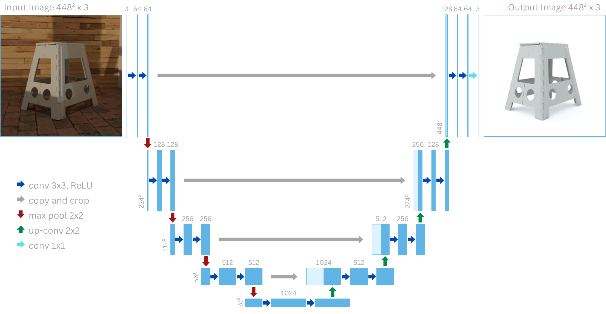
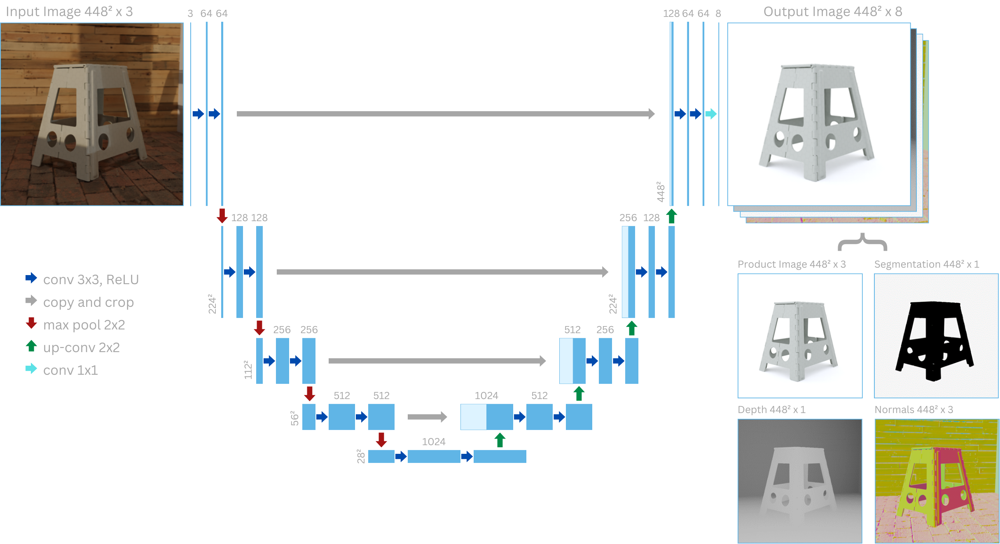

# Automatische Optimierung von Produktbildern

**Semester:** 7 (teilzeit)

**Teammitglieder:** Joël Grosjean

**Coaches:** Adrian Brändli und Moritz Kirschmann

**Datum:** 18.01.2024

## Inhaltsverzeichnis

- [Automatische Optimierung von Produktbildern](#automatische-optimierung-von-produktbildern)
  - [Inhaltsverzeichnis](#inhaltsverzeichnis)
  - [Idee](#idee)
  - [Experimentenreihe](#experimentenreihe)
    - [Entscheidung für Blender](#entscheidung-für-blender)
    - [Aufbau der Bildgenerierung](#aufbau-der-bildgenerierung)
    - [Erste Bildpaare](#erste-bildpaare)
    - [Visualisierungen von Normalen und Distanz zur Kamera](#visualisierungen-von-normalen-und-distanz-zur-kamera)
    - [Produktbild verbessern](#produktbild-verbessern)
    - [Bilder auf SLURM-Cluster generieren](#bilder-auf-slurm-cluster-generieren)
    - [Speicherplatz optimieren](#speicherplatz-optimieren)
    - [Post-Processing auf Bildern durchführen](#post-processing-auf-bildern-durchführen)
    - [Modell trainieren](#modell-trainieren)
  - [Reflexion Lernziele](#reflexion-lernziele)
  - [Meeting Notizen](#meeting-notizen)
    - [18.09.2023 - Kickoff und Definition der Lernziele](#18092023---kickoff-und-definition-der-lernziele)
    - [28.09.2023 - Finalisierung der Lernziele](#28092023---finalisierung-der-lernziele)
    - [04.10.2023 - Update zum Trainingsdaten generieren](#04102023---update-zum-trainingsdaten-generieren)
    - [18.10.2023 - Philosophie und Business Use Case](#18102023---philosophie-und-business-use-case)
    - [01.11.2023 - Stil der Produktfotos](#01112023---stil-der-produktfotos)
    - [29.11.2023 - Erste Bildserie und erstes Modell](#29112023---erste-bildserie-und-erstes-modell)
    - [13.12.2023 - Ausblick auf Fertigstellung](#13122023---ausblick-auf-fertigstellung)

## Idee

## Experimentenreihe

### Entscheidung für Blender

Ein entscheidender Schritt in diesem Projekt war die Generierung von Daten, wofür ich mich für die Verwendung der Software Blender entschieden habe. Diese Entscheidung war durch mehrere Faktoren motiviert.

Zunächst stellte sich heraus, dass andere gängige Programme wie Unreal Engine und Unity eine steilere Lernkurve aufwiesen. Obwohl diese Plattformen leistungsfähig sind, erfordern sie umfangreicheres Vorwissen und längere Einarbeitungszeiten. Im Gegensatz dazu bietet Blender eine benutzerfreundlichere Schnittstelle, die es ermöglicht, schneller produktiv zu arbeiten. Dies war für mein Projekt von wesentlicher Bedeutung, da es mir erlaubte, mehr Zeit für die tatsächliche Arbeit zu verwenden.

Ein weiterer entscheidender Vorteil von Blender ist seine Kompatibilität mit Python. Diese Integration ermöglichte es mir, Blender nahtlos in meinen Workflow einzubinden. Da Python auch für die Modellierung im Data-Science-Bereich verwendet wird, konnte ich Skripte und Funktionen direkt in Blender einbinden. Dies vereinfachte den Prozess der Datengenerierung erheblich, indem es mir ermöglichte, Automatisierungen und spezifische Anpassungen vorzunehmen, die genau auf die Bedürfnisse meines Projekts zugeschnitten waren.

Darüber hinaus bietet Blender eine umfangreiche Community und eine Vielzahl von Ressourcen, die den Einstieg und die Problembehandlung erleichtern. Die Open-Source-Natur von Blender fördert eine kollaborative Umgebung, in der ständig neue Plugins und Funktionen entwickelt werden, die sich ideal für innovative und experimentelle Projekte im Bereich Data Science eignen.

### Aufbau der Bildgenerierung

Folgende Dinge müssen noch im Detail dokumentiert werden:

- grundsätzlicher Aufbau der Blender Image generation
- Beschreibung verschiedener Typen von Elementen in Blender (HDRI, Objekt, Textur)
- Beschreibung Entscheidung Auswahl von Cycles Blender renderer
- Beschreibung verschiedener Arten von Randomness, welche bei Generation hinzugefügt wurden
- Beschreibung was Bilder noch realistischer machen könnte (Grain, Blur, Focus, Surface Imperfections)
- Probleme und Lösungen bei Blender abstürzen

### Erste Bildpaare

Bei dem Experiment, welches auf folgendem Bild dargestellt wird, konnte ich zum ersten Mal Bildpaare von verschiedenen Pflanzen generieren. Es fällt auf, dass die Pflanze bei beiden Bildern des Bildpaares in der gleichen Position mit derselben Ausrichtung ist. Dies hilft, um dem Modell das Training zu erleichtern. Die Kamera zeigt auch immer auf die Pflanze und hat den richtigen Zoom eingestellt, damit die Pflanze einen relativ grossen Teil des Bildes ausfüllt und trotzdem ganz ins Bild passt. Beim zweiten Bild fällt auf, dass der Raum um das Produkt herum hier noch nicht fertig modelliert ist.

### Visualisierungen von Normalen und Distanz zur Kamera

Es können weitere Bilder mit zusätzlichen Informationen hinzugefügt werden, welche später das Modell-Training unterstützen, indem sie dem Modell das 3-Dimensionale Verständnis erleichtern. Dass dies das Training erleichtert, ist zumindest die momentane Hypothese. Im Bild unterhalb sieht man zuoberst das schmutzige Bild, danach eine Visualisierung der Normalen, dann eine Visualisierung der Distanz zur Kamera und als Letztes das Produktbild. Um die Visualisierungen zu generieren habe ich zuerst ein benutzerdefiniertes Shader Node Setup erstellt und füge dieses allen Materialien im Python Script als `Surface` hinzu.

### Produktbild verbessern

### Bilder auf SLURM-Cluster generieren

### Speicherplatz optimieren

### Post-Processing auf Bildern durchführen

### Modell trainieren

- no geometric transformations (normals are broken)

## Reflexion Lernziele

## Meeting Notizen

### 18.09.2023 - Kickoff und Definition der Lernziele

Meeting findet direkt nach Challenge X launch statt. Folgende Dinge werden besprochen:

Organisatorisch:

- Coaches werden Lernziele zusammen bestimmen. Joel wird diese danach noch ergänzen.
- Meeting-Frequenz mit Coaches wurde bestimmt.
- Portfolio soll als Markdown in GitHub gespeichert werden.
- Erste Wochen sollen vor allem zum Trainingsdaten generieren genutzt werden.

Trainingsdaten generieren:

- JSON Datei mit Metadaten soll für jedes Bild zusätzlich generiert werden.
- Tiefeninformation des Bildes kann zusätzlich gespeichert werden.
- Segmentierungsmaske vom Produkt kann zusätzlich gespeichert werden.

### 28.09.2023 - Finalisierung der Lernziele

Beim Meeting waren Joël und Adrian anwesend.

- Die definierten Lernziele wurden ausdiskutiert, aber nicht mehr angepasst. Für Joël und Adrian passen sie so.
- Einige Indikatoren der Lernziele sind für Joël noch unklar, Joël wird dafür eine Fragemail an Moritz senden.
- Adrian bestätigte, dass er nun Zugriff auf die Repositories hat.
- Die Struktur des Portfolios wurde kurz besprochen, Adrian gab kleine Anpassungsvorschläge, aber grundsätzlich findet er die Struktur in Ordnung.

### 04.10.2023 - Update zum Trainingsdaten generieren

Beim Meeting waren Adrian, Moritz und Joël anwesend.

Organisatorisch:

- Ab dem nächsten Meeting sollen die Meetings nicht mehr online, sondern in der FHNW stattfinden.
- Um so viele Bilder zu generieren, braucht es sehr viel GPU Leistung. Moritz organisiert deshalb für ihn und Joël eine Einführung in das Compute-Cluster des i4DS.
- Nach kurzer Diskussion mit Moritz sind nun die Lernziele definitiv für alle.

Trainingsdaten generieren:

- Die Bilder welche die Textur und das Licht trennen, scheinen allen eher nicht sinnvoll zu sein. Deshalb wird Joël diese weglassen.
- Joël fragt, ob das Bild mit der Distanz normalisiert werden sollte. Moritz befindet dies als sinnvoll.
- Das Produktfoto soll noch verbessert werden. Hier soll Joël noch eine Recherche betreiben und experimentieren.
- Es können mehrere Versionen des Produktfotos gespeichert werden. Dies erlaubt im Modell kreative Ansätze auszuprobieren.
- Bilder müssen nicht unbedingt im .PNG format gespeichert werden. Hier kann Speicherplatz eingespart werden.

### 18.10.2023 - Philosophie und Business Use Case

Beim Meeting waren Adrian, Moritz und Joël anwesend.

- Joël hat Blender noch nicht zum Laufen gebracht.
- Beim Produktfoto konnte Joël auch kein Fortschritt machen, da er viele andere Dinge machen musste.
- Adrian stiess eine Diskussion über die Philosophie, warum dieses Produkt nützlich ist, an.
- Adrian regte Joël an noch über den Business Use Case zu reflektieren. Er meinte, es wäre wertvoll sich mit möglichen konkreten Anwendungsfällen zu beschäftigen.
- Es wurde ebenfalls diskutiert, Literatur zu ähnlichen arbeiten in den Bericht einzubringen.

### 01.11.2023 - Stil der Produktfotos

Beim Meeting waren Adrian, Moritz und Joël anwesend.

- Joël hat mit dem Rendern in Compute Cluster einige Fortschritte gemacht, es gibt jedoch immer noch einen Fehler.
- Joël hat einige Vorschläge für den Stil der Produktfotos gemacht und hat diese Ausführlich mit Adrian und Moritz diskutiert.
- Adrian wünscht, dass Joël die gewünschten Eigenschaften für die Produktbilder definiert.

### 29.11.2023 - Erste Bildserie und erstes Modell

Beim Meeting waren Adrian, Moritz und Joël anwesend.

- Joël berichtet, dass er mithilfe von Moritz Blender auf dem Compute Cluster einrichten konnte.
- Joël berichtet ebenfalls, dass er nun eine erste Serie von etwa 1000 Bilder generiert hat.
- Den Stil für die Produktfotos hat Joël nun definiert.
- Ein erstes Modell hat Joël nun auch schon trainiert und präsentiert die Resultate.
- Joël gibt, mithilfe von Moritz, Adrian eine kleine Einführung in Deep Learning.

### 13.12.2023 - Ausblick auf Fertigstellung

Beim Meeting waren Adrian, Moritz und Joël anwesend.

- Anzahl der gesammelten Daten ist mit etwas mehr als 10000 Bildern Okay.
- Format der Verteidigung wurde besprochen. Es gibt eine Präsentation von 30 Minuten.
- Modelle sollen noch verglichen werden und im Bericht beschrieben werden.
- Bilineares Upsampling soll ausprobiert werden, um Schachbrettmuster von Output-Bildern zu entfernen.
- Dokumentation soll aktualisiert werden.
- In der Dokumentation kann über die Erfüllung der Lernziele reflektiert werden.
